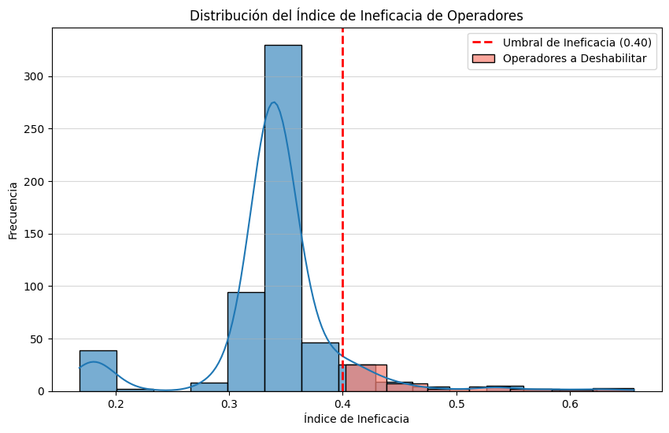

# 📊 Telecommunications Data Analysis 📞

## 🚀 Project Overview

This project focuses on the comprehensive analysis of telecommunications data to extract valuable insights and inform strategic decision-making. Through data manipulation and analysis, we aim to optimize operations, identify areas for improvement, and enhance the overall performance of telecommunications services.

---

## 📂 Project Contents

### Jupyter notebook
- Exploratory Data Analysis (EDA)
- Data cleaning and transformation
- Visualization of key metrics
- Results interpretation

### Python
- `myfunctions.py`: Python script defining reusable functions for data analysis, including:
    - `cambiar_tipo(df)`: Changes the data type of columns.
    - `nulos_analisis(df)`: Analyzes null values.
    - `duplicados_analisis(df)`: Analyzes duplicates.
    - `analisis_clientes(df)`: Performs customer analysis.
    - `analisis_operadores(df)`: Performs operator analysis.
    - `calcular_ineficacia(df)`: Calculates the operator inefficiency index.
    - `eliminar_operadores(df, operadores_a_eliminar)`: Removes specified operators from the DataFrame.
    - `convertir_a_excel(df, nombre_archivo)`: Converts a DataFrame to an Excel file.

### Datasets
- Directory containing input datasets (`telecom_dataset_us.csv`, `telecom_clients_us.csv`)
- Clean output dataset (`telecom_dataset_us_clean.xlsx`).

---

## 📊 Key Visualization

### **Inefficient Operators Distribution**
> 📌 This chart displays the spectrum where operators to be removed are located.

  

## 🧠 Key Findings

### 🤖 **Operator Identification Function**

### Function: `identificar_operadores_a_deshabilitar`

""" python
def identificar_operadores_a_deshabilitar(i_perdidas, i_espera, i_saliente=None, umbral_ineficacia=0.7):
    import pandas as pd
    from sklearn.preprocessing import MinMaxScaler
    import matplotlib.pyplot as plt
    import seaborn as sns

    """
    Calculates an inefficiency index and returns a list of operators exceeding a threshold.

    Args:
        i_perdidas: DataFrame with 'operator_id' and lost call count metric ('total_perdidas').
        i_espera : DataFrame with 'operator_id' and average waiting time metric ('promedio_tiempo_espera').
        i_saliente : DataFrame with 'operator_id' and outgoing call count metric ('total_salientes'). Defaults to None.
        umbral_ineficacia : Threshold for the inefficiency index. Operators with an index greater than or equal to this threshold are considered for disabling.

    Returns:
        list: List of operator names to disable.
    """

    scaler_perdidas = MinMaxScaler()
    i_perdidas['perdidas_norm'] = scaler_perdidas.fit_transform(i_perdidas[['total_perdidas']])

    # --- Normalize waiting time metric ---
    scaler_espera = MinMaxScaler()
    i_espera['espera_norm'] = scaler_espera.fit_transform(i_espera[['promedio_tiempo_espera']])

    # --- Merge lost calls and waiting time DataFrames ---
    df_ineficacia = pd.merge(i_perdidas[['operator_id', 'total_perdidas','perdidas_norm']],
                                     i_espera[['operator_id', 'promedio_tiempo_espera','espera_norm']],
                                     on='operator_id', how='inner')

    if i_saliente is not None:

        scaler_salientes = MinMaxScaler()
        i_saliente['salientes_norm'] = scaler_salientes.fit_transform(i_saliente[['total_salientes']])
        i_saliente['salientes_invertida_norm'] = 1 - i_saliente['salientes_norm']

        df_ineficacia = pd.merge(df_ineficacia,
                                         i_saliente[['operator_id', 'salientes_invertida_norm']],
                                         on='operator_id', how='left')
        df_ineficacia['salientes_invertida_norm'] = df_ineficacia['salientes_invertida_norm'].fillna(0.5)
        df_ineficacia['indice_ineficacia'] = (df_ineficacia['perdidas_norm'] + df_ineficacia['espera_norm'] + df_ineficacia['salientes_invertida_norm']) / 3
    else:
        df_ineficacia['indice_ineficacia'] = (df_ineficacia['perdidas_norm'] + df_ineficacia['espera_norm']) / 2

    # Identify operators exceeding the threshold
    operadores_a_deshabilitar = df_ineficacia[df_ineficacia['indice_ineficacia'] >= umbral_ineficacia]['operator_id'].tolist()
    num_operadores_deshabilitar = len(operadores_a_deshabilitar)
    num_total_operadores = df_ineficacia['operator_id'].nunique()

    if num_total_operadores > 0:
        porcentaje_deshabilitar = (num_operadores_deshabilitar / num_total_operadores) * 100
        print(f"\nThe number of inefficient operators recommended for removal is {num_operadores_deshabilitar}, equivalent to {porcentaje_deshabilitar:.2f}% \nand they are: {operadores_a_deshabilitar}")
    else:
        print("\nNo operators to analyze.")

    # --- Generate the histogram ---
    plt.figure(figsize=(10, 6))
    sns.histplot(df_ineficacia['indice_ineficacia'], bins=15, kde=True, alpha=0.6)
    plt.axvline(umbral_ineficacia, color='red', linestyle='dashed', linewidth=2,
                label=f'Inefficiency Threshold ({umbral_ineficacia:.2f})')

    operadores_deshabilitados_indices = df_ineficacia[df_ineficacia['indice_ineficacia'] >= umbral_ineficacia]['indice_ineficacia']
    sns.histplot(operadores_deshabilitados_indices, color='salmon', kde=False, alpha=0.7,
                label='Operators to Disable')
    plt.title('Distribution of Operator Inefficiency Index')
    plt.xlabel('Inefficiency Index')
    plt.ylabel('Frequency')
    plt.legend()
    plt.grid(axis='y', alpha=0.5)
    plt.show()

    return operadores_a_deshabilitar, df_ineficacia"""

- **MinMaxScaler**: Standardization tool
- **Threshold**: 70%

These findings highlight the function's robust ability to pinpoint inefficient operators, with adjustable sensitivity to meet specific needs, thereby enabling more effective identification strategies.

---

## 🛠️ Tools Utilized

- Python 🐍
- Pandas, NumPy
- Matplotlib, Seaborn
- Scikit-learn
- Jupyter Notebook

---

## 📈 Potential Applications

- **Personnel Optimization:**
    - Identification of inefficient operators to optimize resource allocation.
    - Enhancement of scheduling based on waiting times.
- **Service Improvement:**
    - Reduction of waiting times and lost calls to increase satisfaction.
    - Identification and resolution of the root causes of inefficiency.
- **Capacity Planning:**
    - Anticipation of demand for appropriate resource allocation.
    - Management of call traffic during peak periods.
- **Performance Monitoring:**
    - Utilization of the inefficiency index as a Key Performance Indicator (KPI).
    - Visualization of trends for rapid issue identification.
- **Automation:**
    - Integration of the functions into call center management systems.
    - Generation of automated reports for informed decision-making.

---

## ✅ Conclusion

- **Effective Preprocessing:** Data cleaning and transformation were successfully performed, ensuring the quality of the subsequent analysis.
- **Operator Evaluation:** The `identificar_operadores_a_deshabilitar` function facilitates objective assessment of operator performance.
- **Clear Visualization:** The included charts aid in the straightforward interpretation of the results.
- **Ready-to-Use Data:** A clean dataset in Excel format is provided for further utilization.

---

## 👨‍💻 Author
Juan Cano
Data Analyst | Machine Learning Enthusiast
📧 jpcano983@gmail.com
🔗 [GitHub](https://github.com/Juancanoanalyst)  
🔗 [LinkedIn](https://www.linkedin.com/in/juan-pablo-cano-chaparro/)
